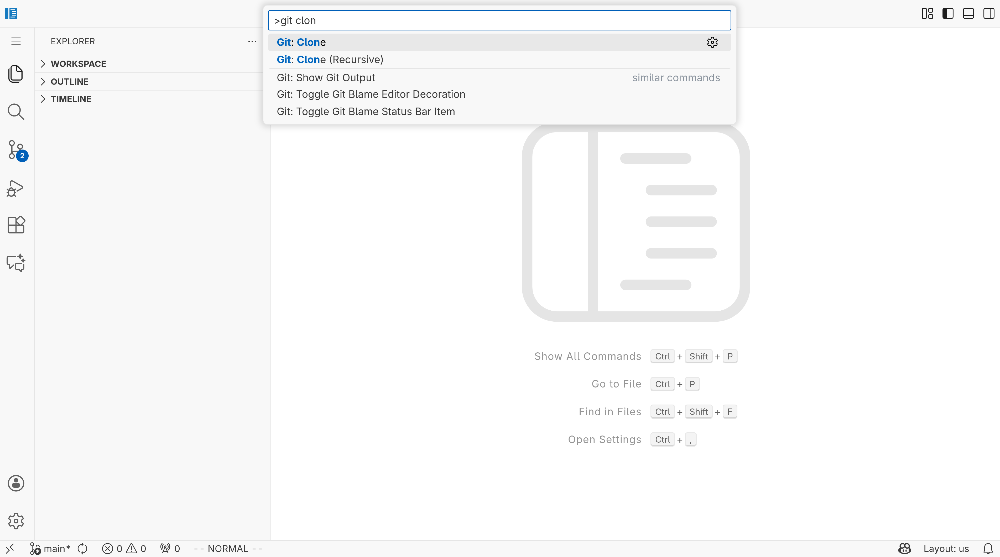
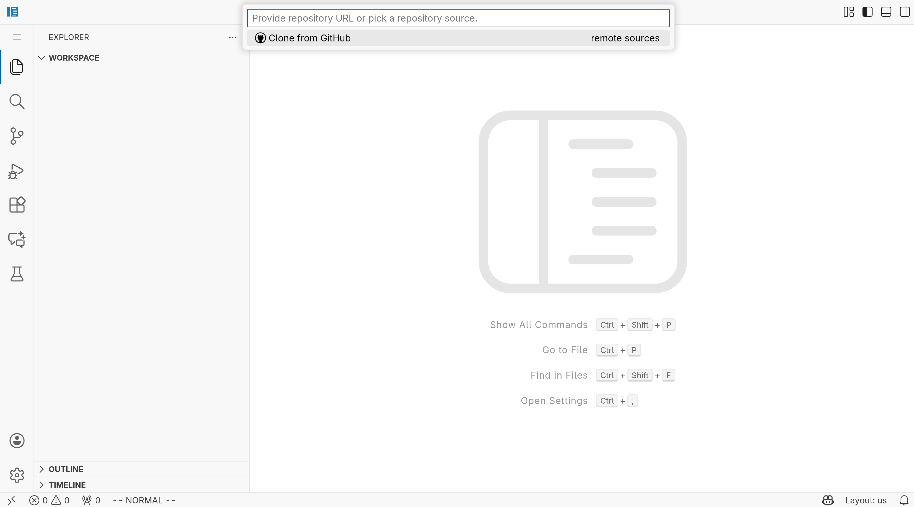
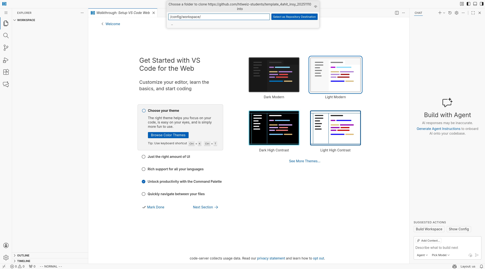
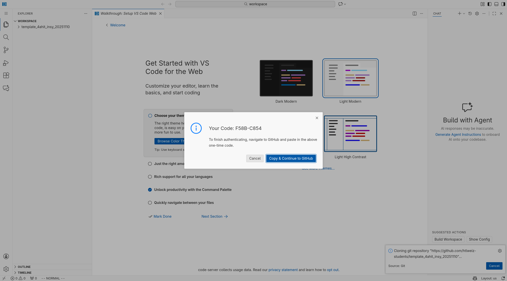
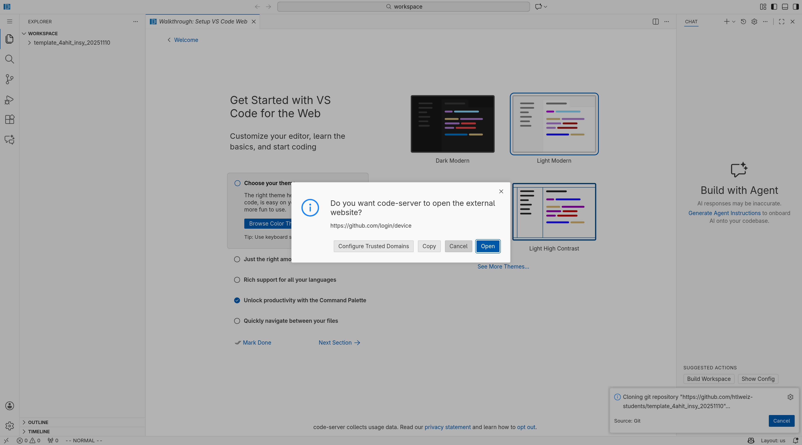
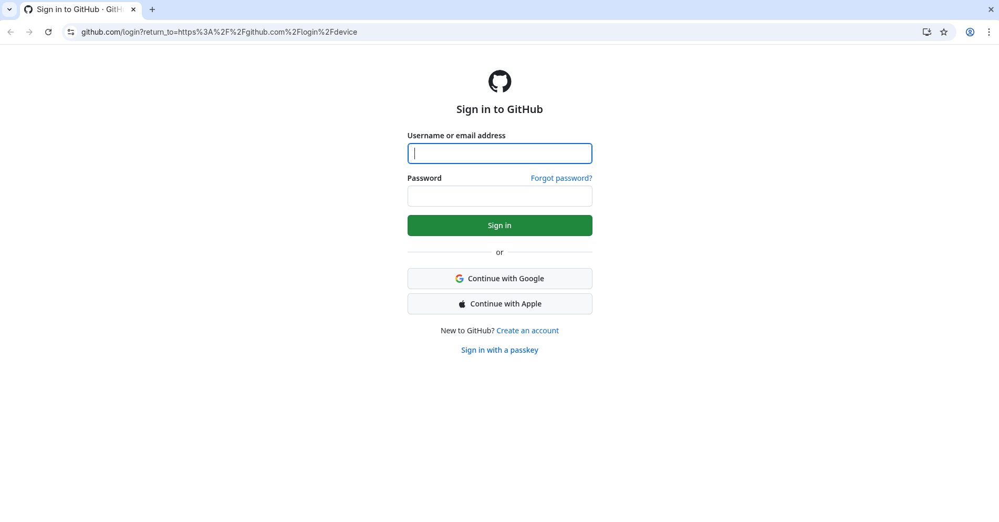
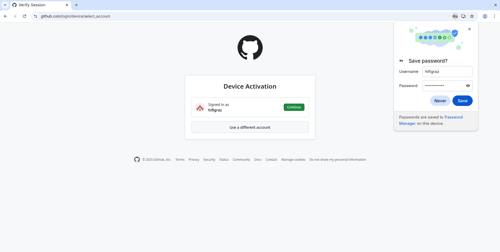
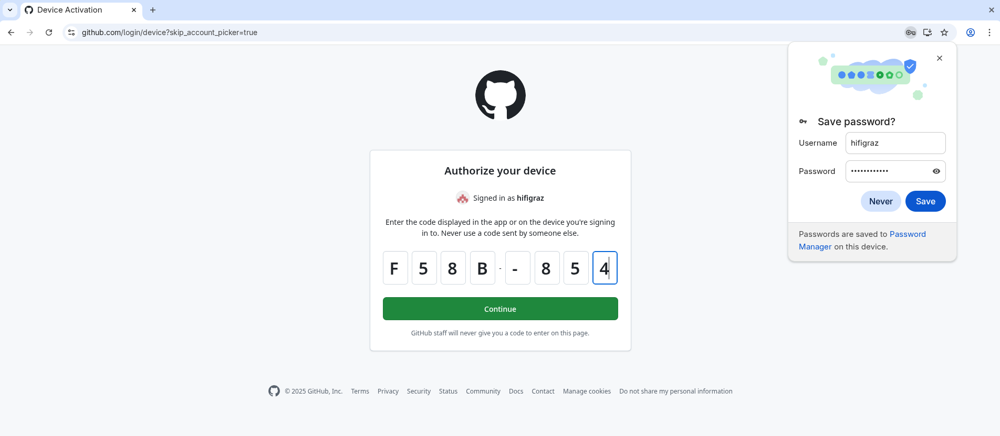
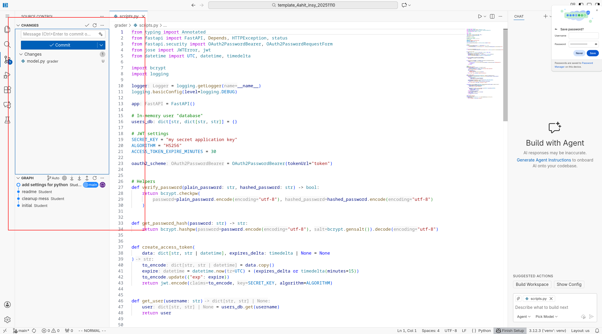

# Arbeitspaket

Haben Sie nach der Anleitung den Codeserver erfolgreich installiert und gestartet, ist es an der Zeit, die Umgebung zu verwenden, um eigene Arbeitspakete zu bearbeiten.

Innerhalb Ihres Code-Server-Editors sollten alle Ihre Dateien im Verzeichnis `/config/workspace` liegen.

Dieser Ordner ist auch in ihrem Hostsystem sichtbar im Verzeichnis `<IhrArbeitsVerzeichnis>\code_server_runner\workspace`.

Es empfiehlt sich, auch in diesem Verzeichnis mit Git-Repositorys zu arbeiten.

## Klonen Ihres Repositorys

Gibt es schon ein Repository, welches zum Beispiel durch die Annahme eines GitHub-Classroom-Links erstellt wurde, dann können Sie dieses auch in Ihren Code-Server-Editor klonen.

In der folgenden Bilderstrecke sind die dazu notwendigen Schritte beschrieben.

### Bilderstrecke

Im Kommando Fenster des Editors `F1` drücken. Können Sie nach `git clone` suchen:

Danach geben Sie bitte die URL des Repositorys ein:

Nachfolgend, geben Sie das Zielverzeichnis für das Repository ein, bitte wählen Sie `/config/workspace` aus. Ist der Klonvorgang erfolgreich, werden Sie gefragt, ob Sie diesen Ordner öffnen wollen. Bitte tun Sie das.

Falls Sie in Ihrem Browser noch nicht bei GitHub angemeldet sind, müssen Sie dies jetzt noch tun. Dafür müssen Sie der `github` Extension das Anmelden bei Github erlauben.

Um Ihrem Code-Server-Editor den Zugriff auf Github zu erlauben, müssen Sie in GitHub einen im Code-Server-Editor generierten One-Time-Code auf der GitHub-Seite eingeben, sobald Sie dazu aufgefordert werden.

Nun werden Sie gefragt, ob Sie die GitHub-Seite öffnen wollen. Falls Sie dies zulassen, öffnet sich ein weiteres Browser-Fenster. Der zuvor generierte One-Time-Code befindet sich jetzt in Ihrer Zwischenablage.

Nun geht es auf GitHub weiter.

Nach erfolgreichem Login, müssen Sie den Account (üblicherweise gibt es nur einen) auswählen, dessen Rechte Sie dem Code-Server-Editor gewähren möchten.

Zum Abschluss werden Sie noch aufgefordert, den One-Time-Code einzugeben. Dieser Code sollte sich noch in Ihrer Zwischenablage befinden.

Nach der Eingabe des Codes wird das Repository in Ihren Code-Server-Editor geklont. War das erfolgreich, werden Sie gefragt, ob Sie diesen neuen Ordner öffnen wollen, bitte bejahen Sie dies. Sie müssen entscheiden, ob Sie den Autoren (also uns) trauen, ohne Vertrauen, steht aber nur sehr eingeschränkte Funktionalität zur Verfügung.

Gratulation, jetzt können Sie mit der Arbeit beginnen.

## Verwaltung von Änderungen

Ab nun ist Ihr Code-Server-Editor in der Lage, dieses Repository zu verwalten. Das bedeutet, dass Sie Änderungen in Ihrem Arbeitspaket bequem über das GUI verwalten können.

Haben wir zum Beispiel die Datei `model.py` hinzugefügt oder geändert, taucht die Änderung im integrierten Git-GUI des Code-Server-Editors auf, kann hier `gestaged` (hinzugefügt), `commited` (versioniert) und `gepushed` (veröffentlicht) werden.

